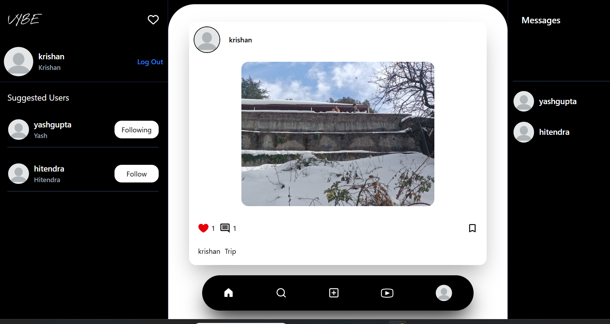
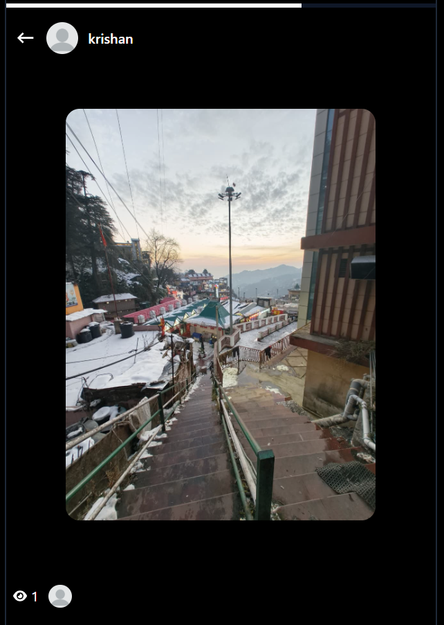
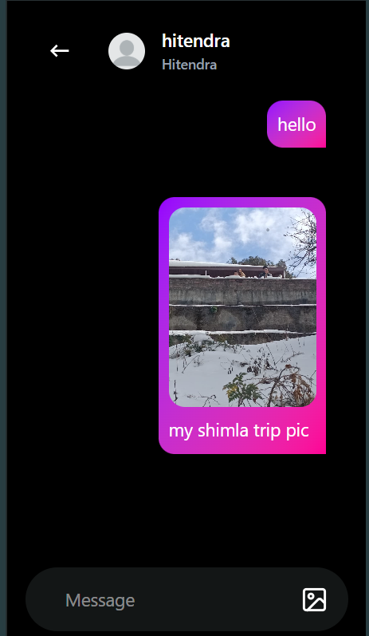

# VybeHub - Social Media Platform

A modern, full-stack social media application built with React, Node.js, Express, MongoDB, and Socket.io. Vybe enables users to connect, share moments, chat in real-time, and discover exciting content.



## � Live Demo

**Try Vybe now:** [https://vybe-have-fun.vercel.app/](https://vybe-have-fun.vercel.app/)

---

## �🎯 Overview

Vybe is a feature-rich social platform that combines the best elements of modern social networks. Users can share posts and reels, create stories, message friends in real-time, and engage through likes, comments, and follows. The platform uses WebSocket technology for instant messaging and online user tracking.

---

## ✨ Key Features

### 👤 Authentication & User Management

- **Sign Up/Sign In** - Secure user registration with bcryptjs password hashing
- **Forgot Password** - OTP-based password reset via email
- **User Profiles** - Customize profiles with:
  - Profile picture
  - Bio and professional information
  - Gender details
  - Follow/Unfollow system
  - View follower/following lists
- **Suggested Users** - Discover new users to follow
- **Online Status** - Real-time online/offline indicators via WebSocket

### 📸 Posts

Share images and videos with your audience

- **Create Posts** - Upload photos/videos with captions
- **Media Support** - Images and video uploads via Cloudinary
- **Engage with Posts**:
  - Like/Unlike posts
  - Comment on posts
  - View post details and comments
- **Save Posts** - Bookmark posts for later
- **Feed** - Chronological feed of posts from followed users



### 🎬 Loops (Short Videos/Reels)

Short-form video content for quick entertainment

- **Create Loops** - Upload short video clips with captions
- **Infinite Scroll** - Discover endless content
- **Engage**:
  - Like/Unlike loops
  - Comment on loops
  - Share reactions
- **Loop Feed** - Browse through trending short videos

### 📖 Stories

Temporary content that expires in 24 hours

- **Create Stories** - Share photos and videos as stories
- **Auto-Expiry** - Stories automatically expire after 24 hours
- **Viewer Tracking** - See who viewed your stories
- **Story Viewing** - Watch stories from people you follow
- **Story Ring** - Visual indicators for unviewed stories

### 💬 Real-Time Messaging

Instant messaging powered by Socket.io WebSocket technology

- **One-on-One Chat** - Private conversations with real-time delivery
- **Online Indicators** - See when friends are online
- **Message History** - View past conversations
- **Media in Messages** - Send images along with messages
- **Typing Indicators** - See when others are typing (ready for implementation)
- **Message Persistence** - All messages saved to database



### 🔔 Notifications

Stay updated with real-time notifications

- **Notification Types**:
  - Post/Loop Likes
  - Post/Loop Comments
  - User Follows
- **Real-Time Alerts** - Instant push notifications via Socket.io
- **Notification Center** - Dedicated page to view all notifications
- **Read/Unread Status** - Track notification status

### 🔍 Search & Discovery

- **User Search** - Find and connect with other users
- **Global Search** - Discover content and profiles

### 📱 Responsive Design

- **Mobile Optimized** - Works seamlessly on all devices
- **Tailwind CSS** - Modern, responsive UI framework
- **Dark Theme** - Dark-themed interface for comfortable viewing

---

## 🏗️ Tech Stack

### Frontend

- **React 19** - UI library
- **Vite** - Lightning-fast build tool
- **Redux Toolkit** - State management
- **Tailwind CSS** - Styling framework
- **React Router** - Navigation
- **Socket.io Client** - Real-time communication
- **Axios** - HTTP client
- **React Icons** - Icon library
- **React Spinners** - Loading indicators

### Backend

- **Node.js & Express** - Server and API
- **MongoDB & Mongoose** - Database
- **Socket.io** - WebSocket for real-time features
- **JWT** - Authentication tokens
- **Bcryptjs** - Password hashing
- **Nodemailer** - Email service for OTP
- **Cloudinary** - Image/Video hosting
- **Multer** - File upload handling
- **Cookie Parser** - Cookie management
- **CORS** - Cross-Origin Resource Sharing

---

## 📂 Project Structure

```
Vybe/
├── backend/
│   ├── config/
│   │   ├── cloudinary.js      # Cloudinary configuration
│   │   ├── db.js              # MongoDB connection
│   │   ├── Mail.js            # Email configuration
│   │   └── token.js           # JWT token utilities
│   ├── controllers/           # Route handlers
│   │   ├── auth.controllers.js
│   │   ├── user.controllers.js
│   │   ├── post.controllers.js
│   │   ├── loop.controllers.js
│   │   ├── story.controllers.js
│   │   └── message.controllers.js
│   ├── models/               # Database schemas
│   │   ├── user.model.js
│   │   ├── post.model.js
│   │   ├── loop.model.js
│   │   ├── story.model.js
│   │   ├── message.model.js
│   │   ├── notification.model.js
│   │   └── conversation.model.js
│   ├── middlewares/
│   │   ├── isAuth.js         # Authentication middleware
│   │   └── multer.js         # File upload middleware
│   ├── routes/               # API endpoints
│   │   ├── auth.routes.js
│   │   ├── user.routes.js
│   │   ├── post.routes.js
│   │   ├── loop.routes.js
│   │   ├── story.routes.js
│   │   └── message.routes.js
│   ├── socket.js             # Socket.io configuration
│   ├── index.js              # Server entry point
│   └── package.json
│
├── frontend/
│   ├── src/
│   │   ├── components/       # Reusable UI components
│   │   │   ├── Feed.jsx
│   │   │   ├── Nav.jsx
│   │   │   ├── Post.jsx
│   │   │   ├── StoryCard.jsx
│   │   │   ├── LoopCard.jsx
│   │   │   ├── NotificationCard.jsx
│   │   │   ├── OnlineUser.jsx
│   │   │   ├── SenderMessage.jsx
│   │   │   ├── ReceiverMessage.jsx
│   │   │   ├── FollowButton.jsx
│   │   │   └── VideoPlayer.jsx
│   │   ├── pages/           # Page components
│   │   │   ├── Home.jsx
│   │   │   ├── Profile.jsx
│   │   │   ├── EditProfile.jsx
│   │   │   ├── Story.jsx
│   │   │   ├── Loops.jsx
│   │   │   ├── Messages.jsx
│   │   │   ├── MessageArea.jsx
│   │   │   ├── Notifications.jsx
│   │   │   ├── Upload.jsx
│   │   │   ├── Search.jsx
│   │   │   ├── SignUp.jsx
│   │   │   ├── SignIn.jsx
│   │   │   └── ForgotPassword.jsx
│   │   ├── hooks/           # Custom React hooks
│   │   │   ├── getAllPost.jsx
│   │   │   ├── getAllLoops.jsx
│   │   │   ├── getAllStories.jsx
│   │   │   ├── getCurrentUser.jsx
│   │   │   ├── getSuggestedUsers.jsx
│   │   │   ├── getFollowingList.jsx
│   │   │   ├── getPrevChatUsers.jsx
│   │   │   └── getAllNotifications.jsx
│   │   ├── redux/           # State management
│   │   │   ├── store.js
│   │   │   ├── userSlice.js
│   │   │   ├── postSlice.js
│   │   │   ├── loopSlice.js
│   │   │   ├── storySlice.js
│   │   │   ├── messageSlice.js
│   │   │   └── socketSlice.js
│   │   ├── App.jsx
│   │   ├── main.jsx
│   │   ├── App.css
│   │   └── index.css
│   ├── public/
│   ├── package.json
│   └── vite.config.js
│
└── README.md
```

---

## 🚀 Getting Started

### Prerequisites

- Node.js (v14 or higher)
- MongoDB (local or MongoDB Atlas)
- npm or yarn

### Backend Setup

1. **Navigate to backend directory**

   ```bash
   cd backend
   ```
2. **Install dependencies**

   ```bash
   npm install
   ```
3. **Create `.env` file** in the backend directory

   ```env
   PORT=8000
   MONGODB_URI=your_mongodb_connection_string
   JWT_SECRET=your_jwt_secret
   CLOUDINARY_CLOUD_NAME=your_cloudinary_name
   CLOUDINARY_API_KEY=your_api_key
   CLOUDINARY_API_SECRET=your_api_secret
   EMAIL_USER=your_email
   EMAIL_PASS=your_email_password
   FRONTEND_URL=http://localhost:5173
   ```
4. **Start the backend server**

   ```bash
   npm run dev
   ```

   Server runs on `http://localhost:8000`

### Frontend Setup

1. **Navigate to frontend directory**

   ```bash
   cd frontend
   ```
2. **Install dependencies**

   ```bash
   npm install
   ```
3. **Start the development server**

   ```bash
   npm run dev
   ```

   App runs on `http://localhost:5173`
4. **Build for production**

   ```bash
   npm run build
   ```

---

## 📡 API Endpoints

### Authentication

- `POST /api/auth/signup` - User registration
- `POST /api/auth/signin` - User login
- `POST /api/auth/forgot-password` - Request password reset OTP
- `POST /api/auth/reset-password` - Reset password with OTP

### User

- `GET /api/user/profile/:userName` - Get user profile
- `POST /api/user/edit-profile` - Update profile
- `POST /api/user/follow/:userId` - Follow user
- `POST /api/user/unfollow/:userId` - Unfollow user
- `GET /api/user/followers` - Get followers list
- `GET /api/user/following` - Get following list
- `GET /api/user/suggested` - Get suggested users

### Posts

- `POST /api/post/create` - Create new post
- `GET /api/post/all` - Get all posts
- `GET /api/post/:postId` - Get single post
- `POST /api/post/like/:postId` - Like post
- `POST /api/post/comment/:postId` - Comment on post
- `POST /api/post/save/:postId` - Save post
- `DELETE /api/post/:postId` - Delete post

### Loops (Reels)

- `POST /api/loop/create` - Create new loop
- `GET /api/loop/all` - Get all loops
- `POST /api/loop/like/:loopId` - Like loop
- `POST /api/loop/comment/:loopId` - Comment on loop
- `DELETE /api/loop/:loopId` - Delete loop

### Stories

- `POST /api/story/create` - Create new story
- `GET /api/story/user/:userId` - Get user's story
- `POST /api/story/:storyId/view` - Mark story as viewed
- `DELETE /api/story/:storyId` - Delete story

### Messages

- `POST /api/message/send` - Send message
- `GET /api/message/:userId` - Get chat history with user
- `GET /api/message/all-conversations` - Get all conversations

### Notifications

- `GET /api/notification/all` - Get all notifications
- `POST /api/notification/:notificationId/read` - Mark notification as read
- `DELETE /api/notification/:notificationId` - Delete notification

---

## 🔐 Security Features

- **Password Encryption** - Bcryptjs for secure password hashing
- **JWT Authentication** - Token-based authentication for API endpoints
- **Email Verification** - OTP-based password reset
- **CORS Protection** - Configured cross-origin resource sharing
- **Cookie-based Sessions** - Secure cookie handling
- **Input Validation** - Backend validation for all inputs

---

## 🎨 User Interface

### Home Page

- Timeline feed of posts from followed users
- Stories carousel at the top
- Suggested users sidebar
- Online users indicator

### Profile Page

- User profile information
- User's posts and loops
- Follow/Unfollow button
- Bio, profession, and gender details

### Messages Page

- Conversation list with recent chats
- Online status indicators
- Message history
- Image sharing in chats

### Stories Page

- View stories from followed users
- Create and share new stories
- Viewer tracking
- 24-hour auto-expiry

### Loops Page

- Infinite scroll through short videos
- Like, comment, and engage features
- Create and share loops

### Notifications

- Real-time notification alerts
- Different notification types (like, comment, follow)
- Read/unread status

---

## 🌐 Real-Time Features

### Socket.io Implementation

The app uses Socket.io for real-time communication:

**Events:**

- `connection` - User connects to socket
- `getOnlineUsers` - Broadcast online users list
- `newNotification` - Send notification when user gets liked/commented/followed
- `sendMessage` - Send messages in real-time
- `receiveMessage` - Receive messages in real-time

**User Online Tracking:**

- Users automatically broadcast online status on connection
- Online users list updates in real-time
- Disconnect automatically removes user from online list

---

## 📊 Database Schema

### User Model

```javascript
{
  name: String,
  userName: String (unique),
  email: String (unique),
  password: String (hashed),
  profileImage: String,
  bio: String,
  profession: String,
  gender: String,
  followers: [ObjectId],
  following: [ObjectId],
  posts: [ObjectId],
  saved: [ObjectId],
  loops: [ObjectId],
  story: ObjectId,
  resetOtp: String,
  otpExpires: Date,
  isOtpVerified: Boolean,
  timestamps: true
}
```

### Post Model

```javascript
{
  author: ObjectId,
  mediaType: "image" | "video",
  media: String,
  caption: String,
  likes: [ObjectId],
  comments: [{author: ObjectId, message: String}],
  timestamps: true
}
```

### Message Model

```javascript
{
  sender: ObjectId,
  receiver: ObjectId,
  message: String,
  image: String,
  timestamps: true
}
```

---

## 🎯 Future Enhancements

- [ ] Direct message groups
- [ ] Story replies and messages
- [ ] Hashtag support
- [ ] Post scheduling
- [ ] Live streaming
- [ ] Payment integration for features
- [ ] Advanced search filters
- [ ] Content recommendation algorithm
- [ ] Story analytics
- [ ] Mobile app (React Native)

---

## 🤝 Contributing

Contributions are welcome! Please feel free to submit pull requests or open issues for bugs and feature requests.

---

## 📄 License

This project is open source and available under the ISC License.

---

## 👨‍💻 Developer

Created by Yash

---

## 📞 Support

For issues, questions, or suggestions, please open an issue on the repository.

---

## 🙏 Acknowledgments

- React and Vite communities
- Socket.io for real-time communication
- Cloudinary for media hosting
- Tailwind CSS for styling
- MongoDB for database

---

**Happy Vybing! 🎉**
